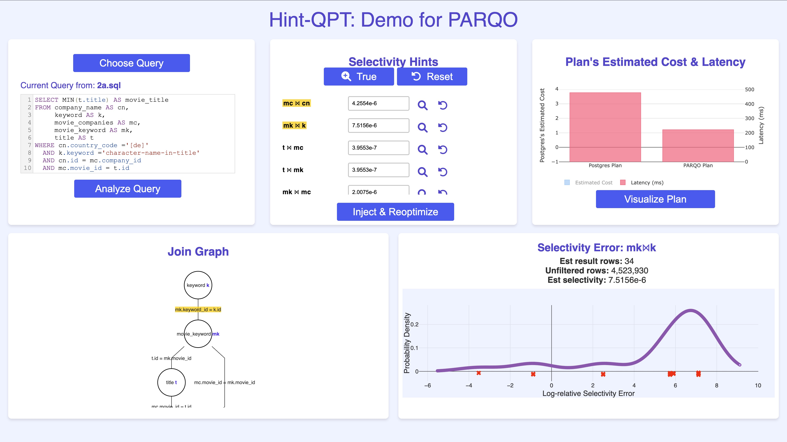
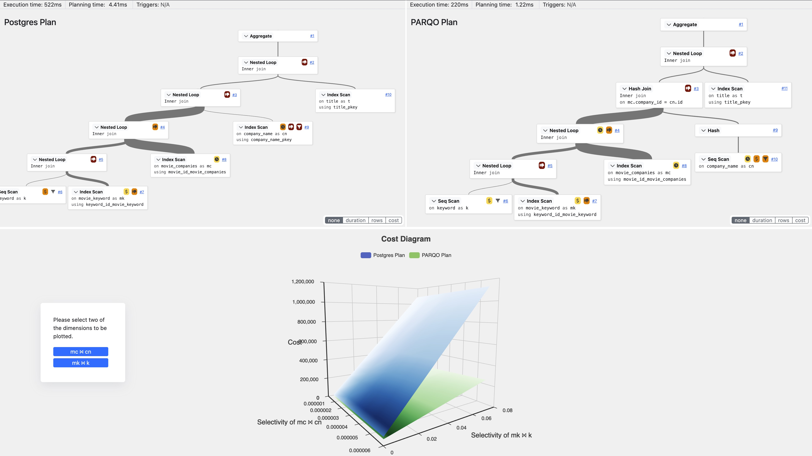

# Hint-QPT: Hints for Robust Query Performance Tuning


This repository contains the code and resources for **Hint-QPT**, an interactive tool proactively recommends robust execution plans that are resilient to selectivity uncertainties, highlights critical subqueries affecting query performance, and facilitates targeted selectivity adjustments to tune query performance. 
HintQPT is based on our research work [PARQO](https://www.vldb.org/pvldb/vol17/p4627-xiu.pdf), a novel SOTA robust query optimization framework published at VLDB 2024, and its GitHub [repo](https://github.com/Hap-Hugh/PARQO).

To see Hint-QPT in action, watch this [video](https://drive.google.com/file/d/118beHtnIVvdFgygvcrNKhD3mdb6EEoM9/view?usp=sharing).


## Preparation
1. Download PostgreSQL 16.2 [here](https://github.com/Hap-Hugh/PG16) and follow the config steps to enable the injection of cardinality (selectivity) and query plans.
2. Install [pg_hint_plan](https://github.com/ossc-db/pg_hint_plan/releases) with the version that works with PostgreSQL 16. (Skip this step if you have done in step 1.)
3. Use <code>initdb</code> to initial a database, and then use <code>pg_ctl</code> to start the Postgres server. Before starting the server, you main consider to modify the postgresql.conf file. Our example conf file can be found [here](https://github.com/Hap-Hugh/PG16), you can directly copy and paste this file to your database data directory generated by Postgres <code>initdb</code>. (Skip this step if you have done in step 1.)

4. Make databases (JOB)
- JOB: please download and load IMDb data to your dbms, you can follow [Balsa](<https://github.com/balsa-project/balsa>) to install the IMDb database.


## 🚀 Running Hint-QPT

1. Open `install.sh` to set up flask environment
   ```sh
   ./install.sh
   
2. Create virtual environment
   ```sh
   poetry shell # make sure the environment is activate. Otherwise use source .venv/bin/activate
   pip install tqdm

3. Run Hint-QPT with:
   ```sh
   flask run


## Front-end GUI of Hint-QPT

### Main page (using Q2 in [JOB](https://github.com/gregrahn/join-order-benchmark))


The join graph is implemented based on [SQLVis](https://github.com/Giraphne/sqlvis).

### Second page (after clicking "visulaize plan" button)


The plan tree visualization is base on [Dalibo-pev2](https://github.com/dalibo/pev2).


## Cite PARQO and Enhance the Impact

We welcome all forms of discussion and collaboration for future research and are eager to help with plan selection in your project. If you find our researcg paper or repository or demo valuable, please consider citing our work:
~~~
@article{DBLP:journals/pvldb/XiuAY24,
  author       = {Haibo Xiu and
                  Pankaj K. Agarwal and
                  Jun Yang},
  title        = {{PARQO:} Penalty-Aware Robust Plan Selection in Query Optimization},
  journal      = {Proc. {VLDB} Endow.},
  volume       = {17},
  number       = {13},
  pages        = {4627--4640},
  year         = {2024},
  url          = {https://www.vldb.org/pvldb/vol17/p4627-xiu.pdf},
  biburl       = {https://dblp.org/rec/journals/pvldb/XiuAY24.bib},
  bibsource    = {dblp computer science bibliography, https://dblp.org}
}
~~~

Hint-QPT's citing format: to be done.

